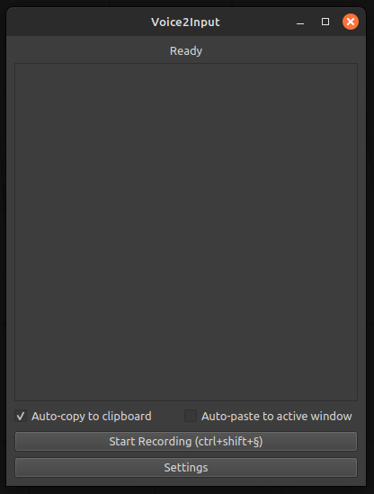
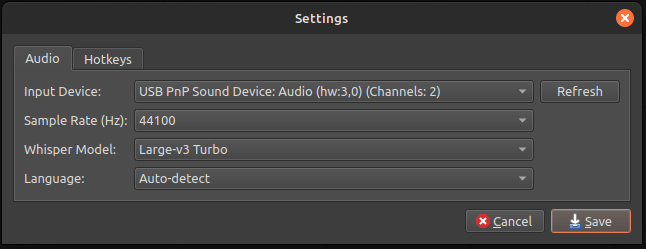

# Voice2Input 🎙️ -> ⌨️

Hey there! Welcome to Voice2Input - your new favorite speech-to-text buddy! This app lets you talk instead of type, and it'll automatically paste your words wherever your cursor is. Super handy for when you're feeling lazy or just want to give your fingers a break! 😊

## ✨ What Makes It Cool

- Uses OpenAI's Whisper models to understand what you're saying
- Works with tons of languages (it can even guess which one you're speaking!)
- Global hotkeys so you can start/stop recording from anywhere
- Automatically copies and pastes your words (if you want it to)
- Saves everything neatly for later use
- Looks pretty sweet with a modern interface





## 🚀 Getting Started

1. Make sure you have Python 3.9+ installed
2. If you're on Linux (which you probably are), grab these:
```bash
sudo apt-get install xsel xdotool portaudio19-dev python3-pyaudio
```

3. Clone this bad boy:
```bash
git clone https://github.com/hosteren/voice2input.git
cd voice2input
```

4. Set up your virtual environment (trust me, it's worth it):
```bash
python -m venv venv
source venv/bin/activate
```
Or use conda:
```bash
conda create -n v2i python=3.10
conda activate v2i
```

5. Install the goodies:
```bash
pip install -r requirements.txt
```

## 🎮 How to Use It

### 🔧 Environment Variables

This project uses a `.env` file to manage sensitive configurations and API credentials. The app loads these variables automatically using [python-dotenv](https://pypi.org/project/python-dotenv/). Either create your own `.env` file or use the `.env.example` file as a template.

### 🔧 Running the App

1. Fire it up:
```bash
python app.py
```

2. Pick your settings (the gear icon is your friend):
   - Choose which mic to use
   - Pick a Whisper model (bigger = better but slower)
   - Set your language (or let it guess)
   - Set up your favorite hotkey combo

3. Start talking:
   - Hit your hotkey (default: Ctrl+Shift+R) or smash that record button
   - Say your piece
   - Release the hotkey
   - Watch the magic happen! ✨

## 🎯 Pro Tips

- The Large-v3 Turbo model is pretty amazing if your GPU can handle it
- Keep your recordings short and sweet for best results
- The auto-paste feature is super convenient but give it a second to work its magic

## 🤔 Something Not Working?

Open an issue! I'm still learning how GitHub works, but I'll figure it out! 😅

## 💝 Credits & Transparency

This app was lovingly crafted with the help of:
- [Cursor](https://cursor.com/) - The AI-powered code editor
- Claude 3 Sonnet - Anthropic's amazing AI assistant
- A lot of coffee ☕

Big thanks to the AI assistants that helped make this possible while keeping the code clean and maintainable!

## 📝 License

MIT - Go wild! Just remember where you got it from! 😉

---
Made with 💖 by a human who talks to computers (literally and figuratively) 